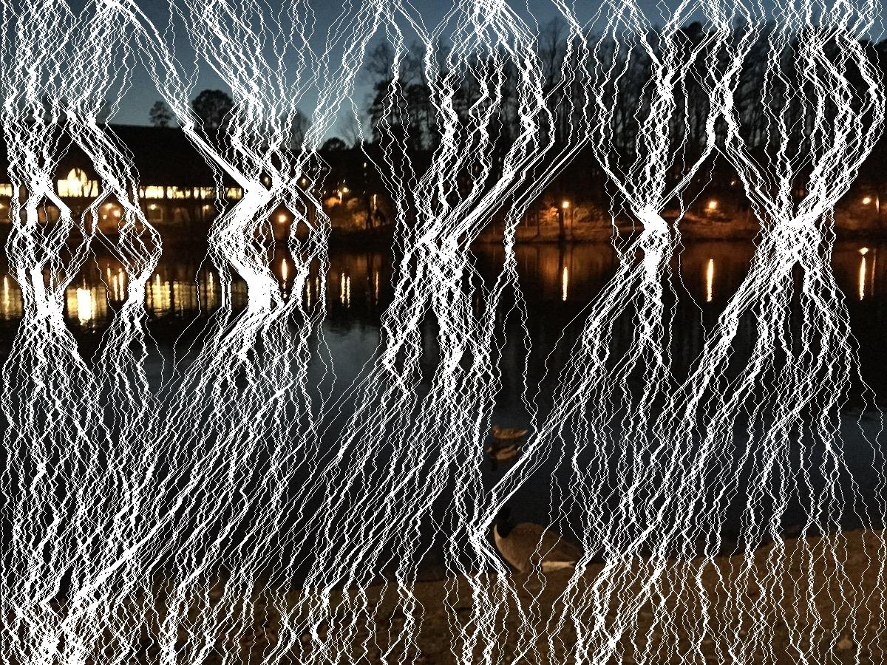

# seam-carving
A Java implementation of Seam Carving, which is an algorithm for content aware image resizing.

## How to use

Take the src folder and place it in a directory where the image you want to resize is. Then open up the console/terminal navigate to the folder then compile the .java files:

```
javac -d out src/com/ardabasaran/*.java
```

This will create a folder called out which will keep the compiled .class files. Then to run the program run this command:

```
java -cp ./out com.ardabasaran.Main [input image] [output image] [width] [height]
```
For example the following command will take the file "input.jpg" carve it down to 500x500 and save it to "output.jpg":

```
java -cp ./out com.ardabasaran.Main input.jpg output.jpg 500 500
```

## Example

### Test Input (1200x900)


### Test Output (900x900)


### Seam Table


### Energy Table
